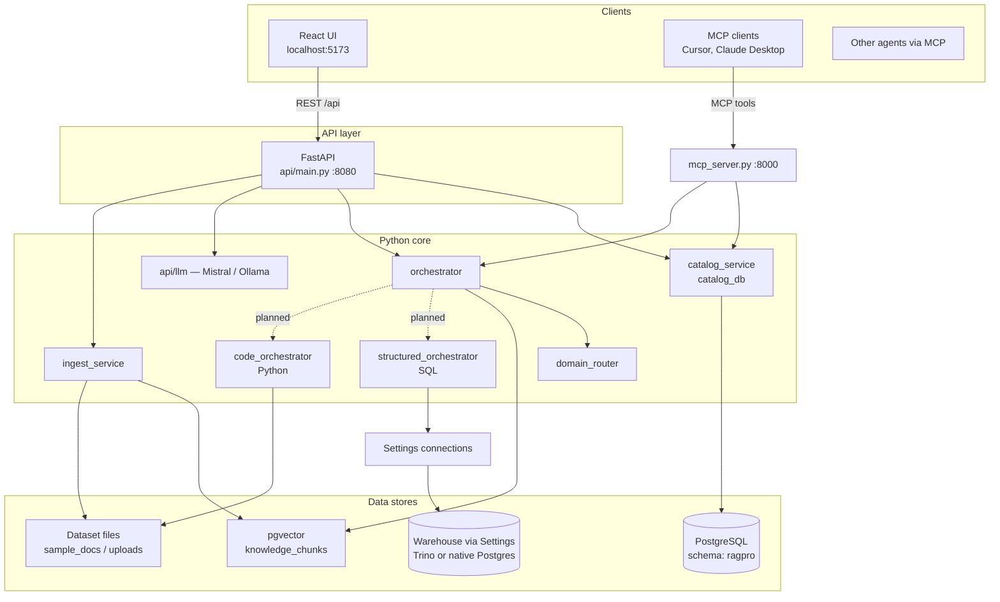
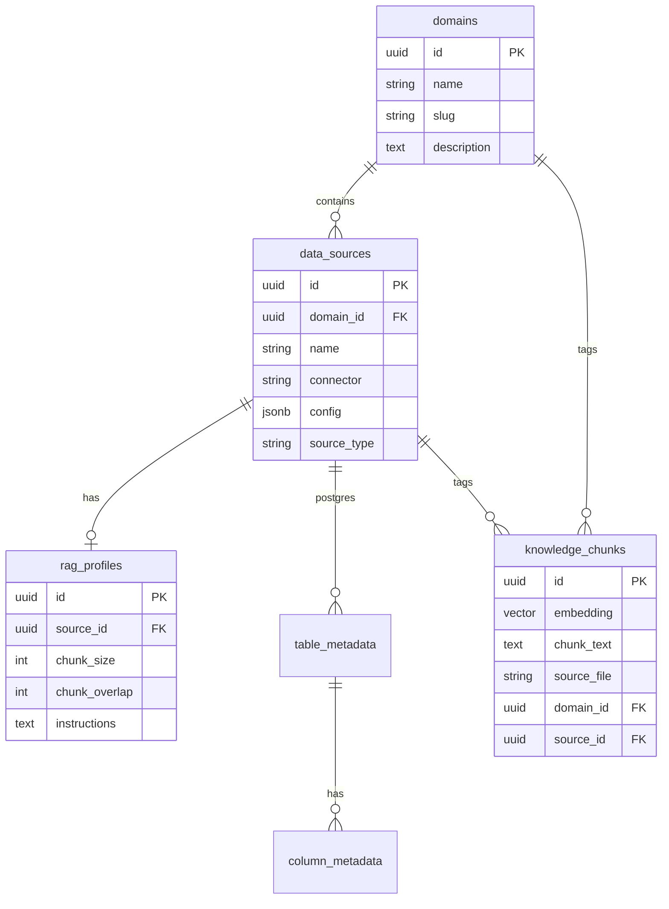
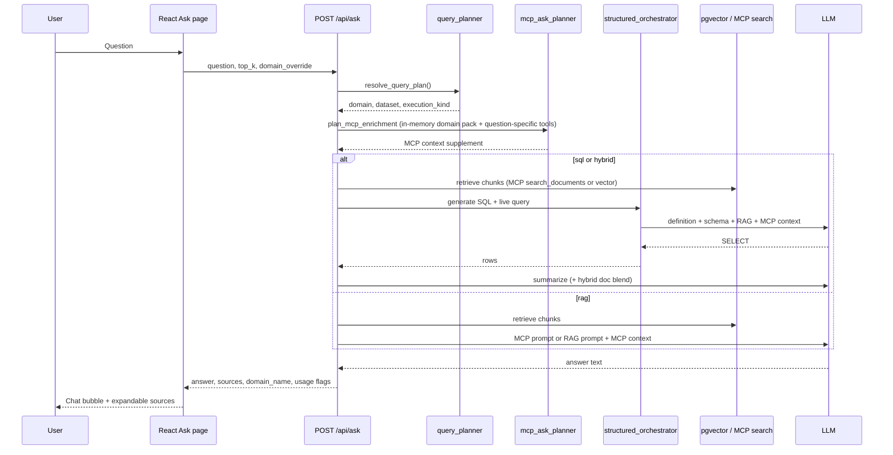
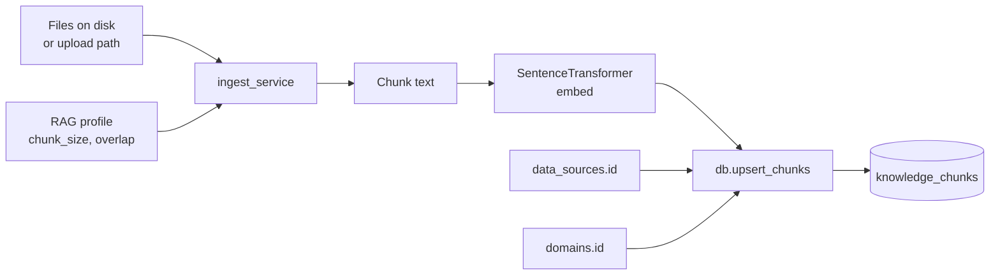

# Architecture

How DATA Pro is put together — components, where data lives, and what happens when you hit Ask.

## Overview

The idea: route questions to the right domain (HR, Finance, …), keep datasets and metadata in a catalog both RAG and SQL paths share, and keep the UI thin — React only talks to FastAPI; MCP reuses the same Python modules.

## Frontend (`web/`)

Vite dev server on 5173, proxies `/api` to FastAPI in dev. TanStack Query for fetching. Tailwind plus a few shared classes (`.btn`, `.card`, `.input`) — no component library layer.

Pages: Catalog, Ask, RAG, Analytics, MCP, Settings. Browser never touches Postgres directly.

## API (`api/`)

| Router | Handles |
|--------|---------|
| `health` | Liveness, chunk/file stats |
| `domains` | Domain CRUD |
| `datasets` | Sources, connections, metadata, ingest |
| `ask` | Question → route → retrieve → LLM |
| `rag` | Per-source profiles, re-ingest |

Startup runs `bootstrap()` — catalog init and embedding model load (`all-MiniLM-L6-v2` by default).

## Core modules (repo root)

| Module | Role |
|--------|------|
| `catalog_db.py` | SQL for domains, sources, RAG profiles, table/column metadata |
| `catalog_service.py` | Paths, ingest orchestration, `definition.md` |
| `db.py` | `knowledge_chunks`, pgvector search |
| `ingest_service.py` | Chunk PDFs/text, embed, upsert |
| `domain_router.py` | Keyword/embedding routing |
| `scope_resolver.py` | Metadata-only narrow-down: tables, files, columns |
| `orchestrator.py` | Route → classify execution kind → scoped chunk search |
| `structured_orchestrator.py` | Read-only SQL via LLM |
| `code_orchestrator.py` | pandas scripts for CSV/large files |
| `mcp_server.py` | MCP tools/resources over same stack |

MCP runs as its own process on port 8000 so agents don't need the UI.

## Catalog model

Connectors on `data_sources`: `trino` (preferred for warehouse SQL), legacy `postgres`, `upload`, `file_path`, `api`, `sharepoint`, `web_url`. Each connector implements the same adapter surface in `dataset_connectors/` (`test_connection`, `list_assets`, `sync`, `build_schema_context`). Remote connectors (API, web link, SharePoint) fetch into the dataset cache folder, then share the upload RAG ingest path.

Files from upload/path/remote connectors become chunks in `knowledge_chunks`. Trino and legacy Postgres connectors introspect live schemas; `table_metadata` / `column_metadata` feed SQL generation. Business SQL executes through Trino when `connector=trino`; see [trino.md](trino.md).

Migrations in `migrations/`; schema name defaults to `ragpro` (`DB_SCHEMA`). Connection setup for new clones: [catalog-database.md](catalog-database.md).

## Ask flow

`domain_override` skips routing. Otherwise `query_planner` / `domain_router` pick domain and execution path (`sql`, `rag`, `hybrid`). After domain and dataset selection, **`scope_resolver.py`** narrows to relevant **tables**, **files**, and **column hints** using catalog metadata only (no content-chunk search during routing). Chunk vector search runs after scope is set, optionally filtered by `source_file` paths derived from the narrowed tables/files.

**Follow-up context (Ask and Analytics):** The UI sends recent turns plus the prior structured result (SQL, columns, rows) in `conversation_history`. Before each request, `conversation_session.py` either (a) detects a **new topic** via LLM and clears context, (b) after **N follow-ups** (Settings → `ASK_CONVERSATION_TURNS`, default 5) **summarizes** the session and starts a fresh chat, or (c) keeps context for a true follow-up. `structured_follow_up.py` then decides transform vs refined SQL.

**Domain MCP bindings** attach reference **resources** (`schema`, `calendar`, `glossary`), **tools**, and **prompts**. Ask/Analytics keep a warmed **domain context pack** in API memory (bindings + reference texts + default MCP plan) so each question skips catalog re-scans; only question-specific tools still run live. Catalog writes clear the pack. Agents may also render `domain_sql_context` / `domain_grounded_answer` prompts.

## Execution kinds

| Kind | For | What happens |
|------|-----|--------------|
| `rag` | Docs, policies | pgvector → answer LLM |
| `sql` | Postgres analytics | LLM writes read-only SELECT |
| `python` | CSV / big files | pandas script, sandboxed |
| `hybrid` | Both | SQL/Python + RAG chunks → answer LLM |

Pipeline we're aiming for: route domain + dataset → load `definition.md` and schema context → LLM generates SQL or Python to shrink data → run in a sandbox (not inside the API process) → answer LLM gets curated rows plus optional chunks.

`GET /api/datasets/{id}/schema-context` returns prompt blocks for SQL/Python grounding.

**Structured SQL prompts** assemble context in this order: allowed tables → dataset definition → column reference → optional **retrieved RAG chunks** and **MCP domain context** (resources + tool results from bindings). Catalog definition and columns remain authoritative for table/column names and joins. Fact table rows are queried live from the source database — only metadata and lookup rows are RAG-embedded.

## Ingest

Re-ingest from a dataset **RAG** tab (`POST /api/datasets/{id}/rag/ingest`) or the MCP `ingest_documents` tool.

## Running it today vs production

Dev is usually three processes: API on 8080, Vite on 5173, MCP on 8000.

Production target (not fully there yet): API container with secrets from env or a secret manager, static `web/dist` behind nginx or a CDN, MCP as its own service, Python/SQL sandbox on isolated compute. Mounting `web/dist` on FastAPI is an easy simplification if you don't need separate scaling.

## Security

SQL path is read-only by design; dataset credentials sit in catalog config (encrypt at rest in prod). Python path must not run arbitrary code in the API worker — sandbox first. Keys and DB passwords in `.env` or a secret manager; see [secrets.md](secrets.md).

## Extending

- New connector: catalog type + UI + `catalog_service` path logic
- New domain: UI or `POST /api/domains`
- Routing tweaks: `domain_router.py` or richer domain descriptions
- Agents: MCP tools or plain `/api/ask`
- Configurable agents (`agent_runner.py`, `agent_mcp_runner.py`): on save, `save_agent_mcp_kit` pins domain tools/prompts/resources (plus Advanced extras). Execute uses that kit without the Ask planner. SQL KPI/report still uses `run_analytics_events`.
- Agent flows (`agent_flow_runner.py`): DAG of **agent** nodes and **custom** instruction nodes; connected steps pass result summaries (including table previews) downstream
- **Per-table / per-file RAG** (Catalog → dataset → **RAG** tab): `table_metadata.rag_enabled`, per-row chunk settings, `source_file_rag` for documents; ingest via `POST /api/datasets/{id}/rag/ingest`
- Domain MCP: bind tools/resources/prompts per domain in Catalog → MCP; Ask/Analytics use a warmed `domain_context` pack plus `mcp_ask_planner` for question-specific tools
