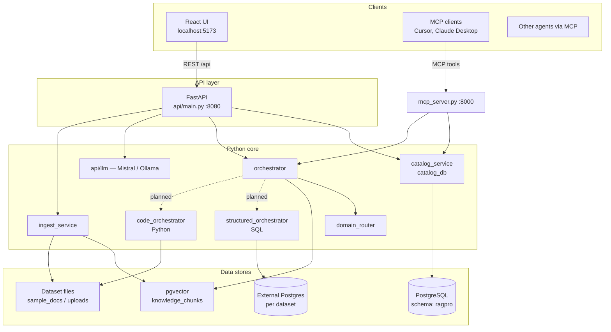
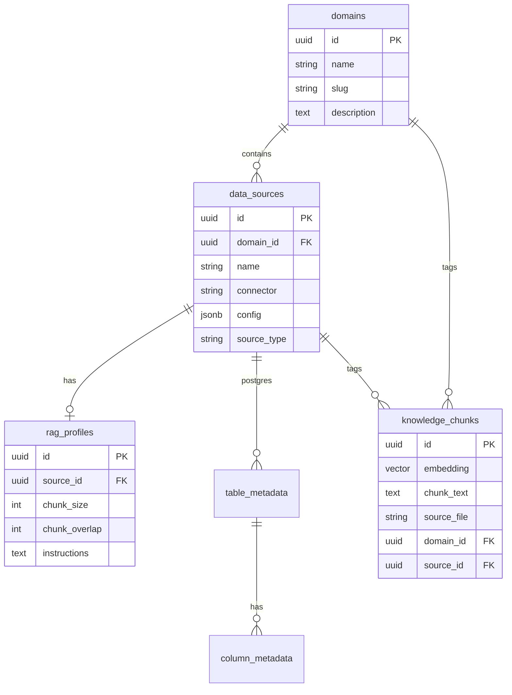
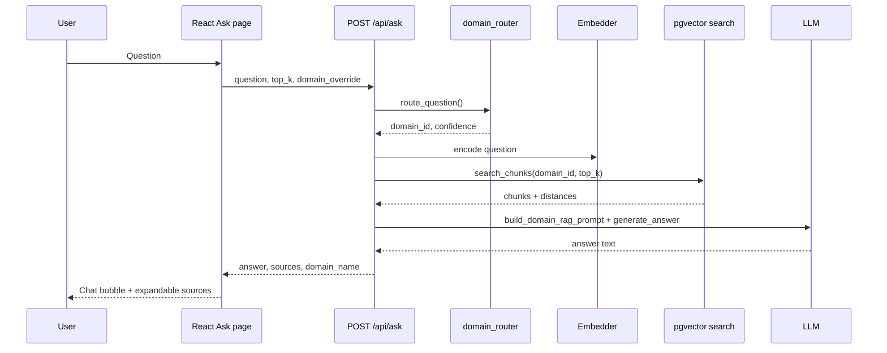
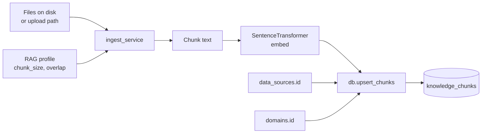

# DATA Pro — Architecture

This document describes how the multi-domain analytics platform is structured: components, data flows, storage model, and planned execution paths.

## System overview

## Design goals

1. **Domain-aware answers** — route questions to HR, Finance, Sales, or General before retrieval.
2. **Catalog-first** — datasets, definitions, and metadata are first-class; RAG and SQL/Python paths share the same catalog.
3. **Separation of UI and logic** — React talks only to FastAPI; Python modules are reused by MCP.
4. **Grounded responses** — answers cite ingested chunks; future paths curate tabular data before the answer LLM runs.

## Runtime components

### React frontend (`web/`)

| Piece | Role |
|-------|------|
| **Vite dev server** | Serves UI; proxies `/api` → FastAPI in development |
| **TanStack Query** | API data fetching and cache invalidation |
| **Tailwind + index.css** | Utility CSS and a few shared classes (`.btn`, `.card`, `.input`) — no Radix/shadcn |
| **Pages** | Catalog (datasets), Ask (chat), RAG (profiles) |

The browser cannot run Python or connect to Postgres directly; all data operations go through the API.

### FastAPI (`api/`)

| Router | Responsibility |
|--------|----------------|
| `health` | Liveness and chunk/file stats |
| `domains` | CRUD for business domains |
| `datasets` | Datasets, connections, metadata, definitions, ingest |
| `ask` | Question → route → retrieve → LLM answer |
| `rag` | Per-source RAG profile and re-ingest |

On startup, `bootstrap()` initializes the catalog and loads the embedding model once (`all-MiniLM-L6-v2`).

### Python core (repository root)

| Module | Responsibility |
|--------|----------------|
| `catalog_db.py` | SQL for domains, `data_sources`, `rag_profiles`, `table_metadata`, `column_metadata` |
| `catalog_service.py` | File paths, ingest orchestration, `definition.md` read/write |
| `db.py` | `knowledge_chunks` + pgvector similarity search |
| `ingest_service.py` | PDF/text chunking, embedding, upsert |
| `domain_router.py` | Keyword/embedding routing to a domain |
| `orchestrator.py` | End-to-end retrieval: route → classify execution kind → search chunks |
| `structured_orchestrator.py` | LLM-generated read-only SQL against dataset Postgres connections |
| `code_orchestrator.py` | LLM-generated pandas scripts for CSV/large files |
| `mcp_server.py` | MCP tools/resources/prompts over the same DB and ingest stack |

### MCP server (`mcp_server.py`)

Runs as a separate process (default port **8000**). External agents call `search_documents`, `ingest_documents`, etc., without the React UI. Configuration shares `.env` / secrets with the API.

## Data model (catalog)

**Connectors** on `data_sources`: `postgres`, `upload`, `file_path`, `api`, `sharepoint`, `web_url`.

- **Unstructured** connectors (`upload`, `file_path`, …) → files chunked into `knowledge_chunks`.
- **Postgres** connectors → live DB introspection; `table_metadata` / `column_metadata` ground SQL generation.

Migrations live in `migrations/`; schema name defaults to **`ragpro`** (`DB_SCHEMA`).

## Ask flow (current — unstructured RAG)

**Routing:** `domain_override` forces a domain; otherwise `domain_router` scores domains using catalog keywords and optional embeddings.

**Fallback:** If no chunks match within the routed domain, search runs globally.

**Not yet wired:** When `execution_kind` is `sql`, `python`, or `hybrid`, `/api/ask` still uses vector RAG only. Classification is computed in `orchestrator.py` for future use.

## Planned execution paths

The orchestrator classifies each question into an **execution kind**:

| Kind | Use case | LLM output | Execution |
|------|----------|------------|-----------|
| **rag** | Policies, docs, Q&A | — | pgvector retrieval → answer LLM |
| **sql** | Analytics on Postgres datasets | Read-only `SELECT` | Run against dataset connection |
| **python** | CSV / large files | pandas script → `result` dict | Sandboxed exec (local guarded; ECS later) |
| **hybrid** | Tabular + document context | SQL or Python + RAG | Combined payload → answer LLM |

Intended pipeline:

1. Route **domain** and **dataset**
2. Load **definition.md**, table/column labels, or file listing as context
3. LLM writes **SQL or Python** to reduce large data to a small result set
4. **Sandbox** runs untrusted code outside the API container (AWS Fargate/Lambda target)
5. **Answer LLM** receives curated rows plus optional RAG chunks

`GET /api/datasets/{id}/schema-context` returns prompt blocks for SQL/Python grounding.

## Ingest flow

Re-ingest from the RAG page or `POST /api/rag/sources/{id}/reingest` applies the current profile to all files in the dataset folder.

## Deployment shape (target)

Today development runs three optional processes:

| Process | Port | Purpose |
|---------|------|---------|
| `uvicorn api.main:app` | 8080 | REST API |
| `npm run dev` (Vite) | 5173 | Frontend dev |
| `python mcp_server.py` | 8000 | MCP |

**Target production (not fully implemented):**

- API container on ECS (or similar) with env secrets
- Static `web/dist` behind CDN or same ALB
- MCP as separate service or sidecar
- Python/SQL sandbox on Fargate — isolated from API

Single-port serving (FastAPI mounting `web/dist`) is a straightforward follow-up for simpler deploys.

## Security notes

- **SQL path** — designed for read-only queries; connection credentials stored per dataset in catalog config (encrypt at rest in production).
- **Python path** — must not run arbitrary code in the API process; sandbox is required before production use.
- **Secrets** — keep `MISTRAL_API_KEY` and DB passwords in `.env` or a secret manager; never commit `.env`. See [docs/secrets.md](secrets.md).

## Extension points

| Area | How to extend |
|------|----------------|
| New connector | Add type in catalog + UI + `catalog_service` path/connection logic |
| New domain | Catalog UI or `POST /api/domains` |
| Custom routing | Extend `domain_router.py` or domain descriptions in DB |
| Agent access | MCP tools in `mcp_server.py` or direct `/api/ask` |
| Structured Ask | Wire `structured_orchestrator` / `code_orchestrator` into `api/routers/ask.py` |

## Related documentation

- [Installation](installation.md) — setup and scripts
- [MCP](mcp.md) — tools, resources, client configuration
- [User guide](user-guide.md) — catalog and RAG workflows
