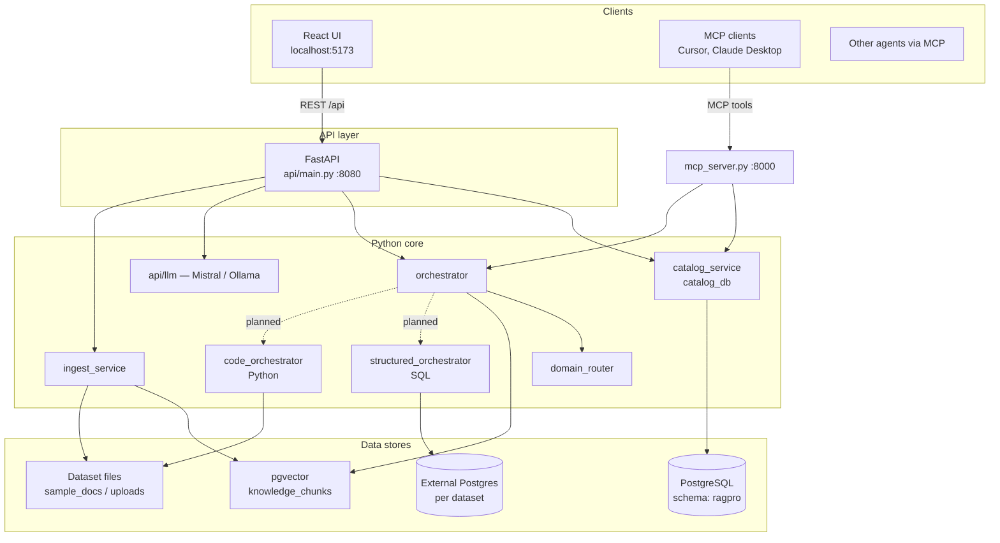
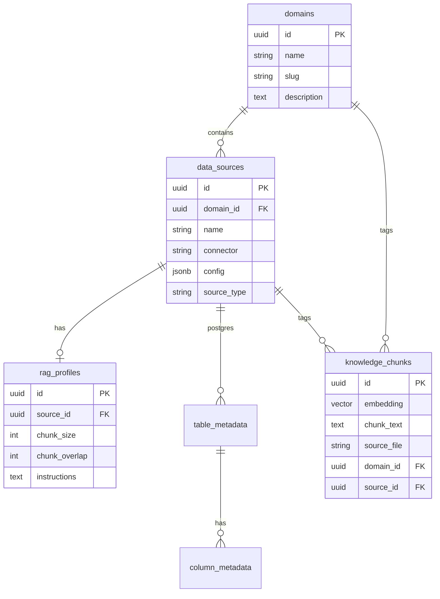
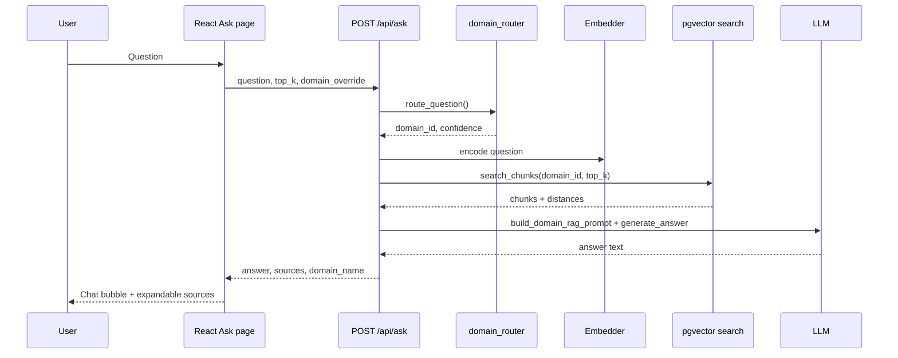
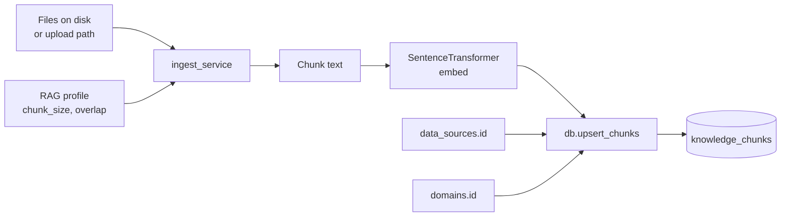

# Architecture

How DATA Pro is put together — components, where data lives, and what happens when you hit Ask.

## Overview

The idea: route questions to the right domain (HR, Finance, …), keep datasets and metadata in a catalog both RAG and SQL paths share, and keep the UI thin — React only talks to FastAPI; MCP reuses the same Python modules.

## Frontend (`web/`)

Vite dev server on 5173, proxies `/api` to FastAPI in dev. TanStack Query for fetching. Tailwind plus a few shared classes (`.btn`, `.card`, `.input`) — no component library layer.

Pages: Catalog, Ask, RAG, Analytics, MCP, Settings. Browser never touches Postgres directly.

## API (`api/`)

| Router | Handles |
|--------|---------|
| `health` | Liveness, chunk/file stats |
| `domains` | Domain CRUD |
| `datasets` | Sources, connections, metadata, ingest |
| `ask` | Question → route → retrieve → LLM |
| `rag` | Per-source profiles, re-ingest |

Startup runs `bootstrap()` — catalog init and embedding model load (`all-MiniLM-L6-v2` by default).

## Core modules (repo root)

| Module | Role |
|--------|------|
| `catalog_db.py` | SQL for domains, sources, RAG profiles, table/column metadata |
| `catalog_service.py` | Paths, ingest orchestration, `definition.md` |
| `db.py` | `knowledge_chunks`, pgvector search |
| `ingest_service.py` | Chunk PDFs/text, embed, upsert |
| `domain_router.py` | Keyword/embedding routing |
| `orchestrator.py` | Route → classify execution kind → search chunks |
| `structured_orchestrator.py` | Read-only SQL via LLM |
| `code_orchestrator.py` | pandas scripts for CSV/large files |
| `mcp_server.py` | MCP tools/resources over same stack |

MCP runs as its own process on port 8000 so agents don't need the UI.

## Catalog model

Connectors on `data_sources`: `postgres`, `upload`, `file_path`, `api`, `sharepoint`, `web_url`.

Files from upload/path connectors become chunks in `knowledge_chunks`. Postgres connectors introspect live DBs; `table_metadata` / `column_metadata` feed SQL generation.

Migrations in `migrations/`; schema name defaults to `ragpro` (`DB_SCHEMA`).

## Ask flow (document RAG today)

`domain_override` skips routing. Otherwise `domain_router` scores domains from catalog keywords/embeddings. No hits in the routed domain → search widens globally.

`orchestrator.py` already classifies `execution_kind` (`sql`, `python`, `hybrid`) but `/api/ask` still uses vector RAG only for now — wiring structured paths is the next step.

## Execution kinds (where it's headed)

| Kind | For | What happens |
|------|-----|--------------|
| `rag` | Docs, policies | pgvector → answer LLM |
| `sql` | Postgres analytics | LLM writes read-only SELECT |
| `python` | CSV / big files | pandas script, sandboxed |
| `hybrid` | Both | SQL/Python + RAG chunks → answer LLM |

Pipeline we're aiming for: route domain + dataset → load `definition.md` and schema context → LLM generates SQL or Python to shrink data → run in a sandbox (not inside the API process) → answer LLM gets curated rows plus optional chunks.

`GET /api/datasets/{id}/schema-context` returns prompt blocks for SQL/Python grounding.

## Ingest

Re-ingest from the RAG page or `POST /api/rag/sources/{id}/reingest`.

## Running it today vs production

Dev is usually three processes: API on 8080, Vite on 5173, MCP on 8000.

Production target (not fully there yet): API container with secrets from env or a secret manager, static `web/dist` behind nginx or a CDN, MCP as its own service, Python/SQL sandbox on isolated compute. Mounting `web/dist` on FastAPI is an easy simplification if you don't need separate scaling.

## Security

SQL path is read-only by design; dataset credentials sit in catalog config (encrypt at rest in prod). Python path must not run arbitrary code in the API worker — sandbox first. Keys and DB passwords in `.env` or a secret manager; see [secrets.md](secrets.md).

## Extending

- New connector: catalog type + UI + `catalog_service` path logic
- New domain: UI or `POST /api/domains`
- Routing tweaks: `domain_router.py` or richer domain descriptions
- Agents: MCP tools or plain `/api/ask`
- Structured Ask: wire `structured_orchestrator` / `code_orchestrator` into `api/routers/ask.py`
