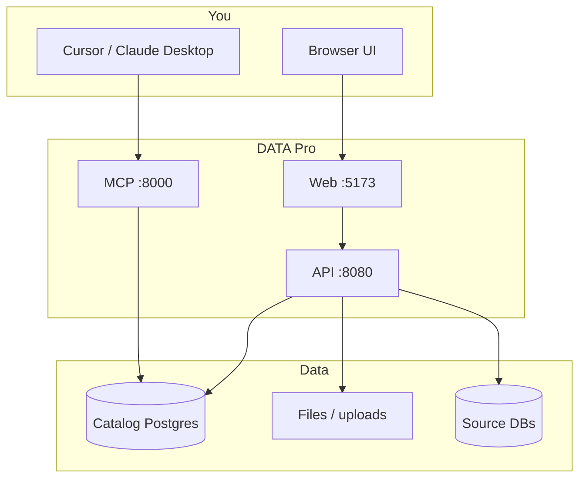

# Concepts

## RAG

RAG here is pretty standard: your files get split into chunks, each chunk gets an embedding stored in Postgres (pgvector), and when someone asks a question we find similar chunks and pass them to the LLM as context. Answers should cite the source chunks instead of making things up.

In the UI: add data under **Data Catalog**, run ingest on the **RAG** page, then ask questions on **Ask**.

## MCP

MCP (Model Context Protocol) is how external agents — Cursor, Claude Desktop, etc. — call into DATA Pro: search chunks, list sources, trigger ingest, read resources.

The browser UI is for humans. The MCP server (port 8000) is for tools in your IDE. You don't need MCP to use the app; see [mcp.md](mcp.md) when you want it.

## How it fits together

Rough order of operations: install → **Settings** (LLM + DB) → catalog domain + dataset → ingest → **Ask** → optionally wire up MCP.
