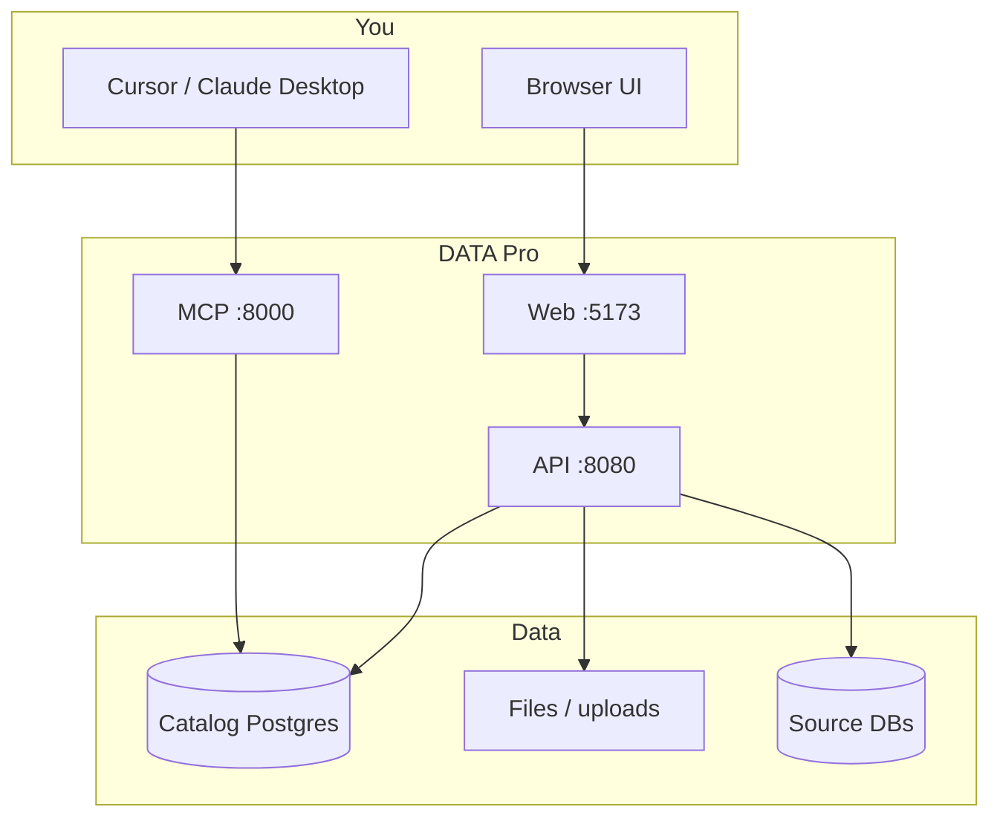
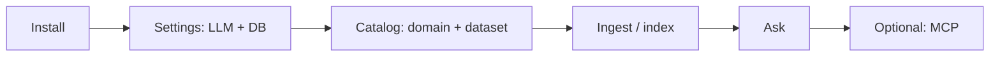

# Concepts

## RAG (Retrieval-Augmented Generation)

1. Files and catalog text are split into **chunks**.
2. Each chunk is **embedded** and stored in Postgres (**pgvector**).
3. A question finds similar chunks and sends them to an **LLM** as context.
4. Answers are **grounded** in your data, with citations.

Manage RAG in the UI: **Data Catalog** → add data → **RAG** → ingest → **Ask**.

## MCP (Model Context Protocol)

**MCP** lets AI assistants (Cursor, Claude Desktop) call DATA Pro — search, ingest, read resources.

- **Browser UI** — for people (catalog, ask, settings).
- **MCP server** — for agents in your IDE.

MCP is optional. See [MCP guide](mcp.md).

## How it fits together

## Typical journey

